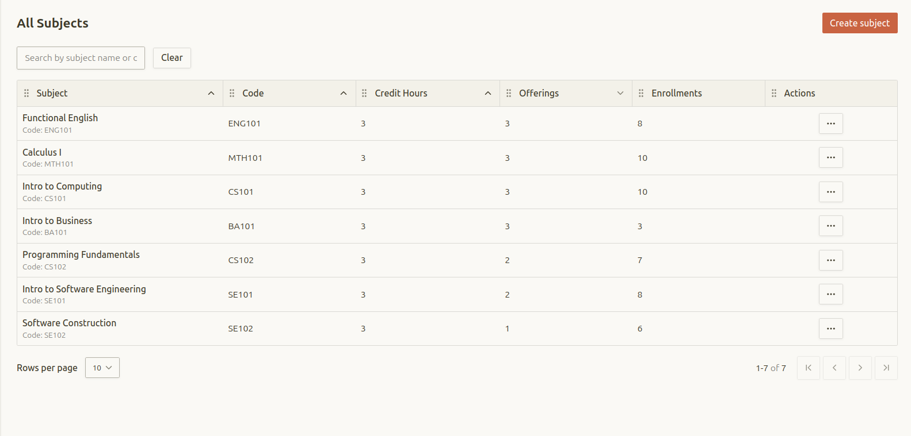
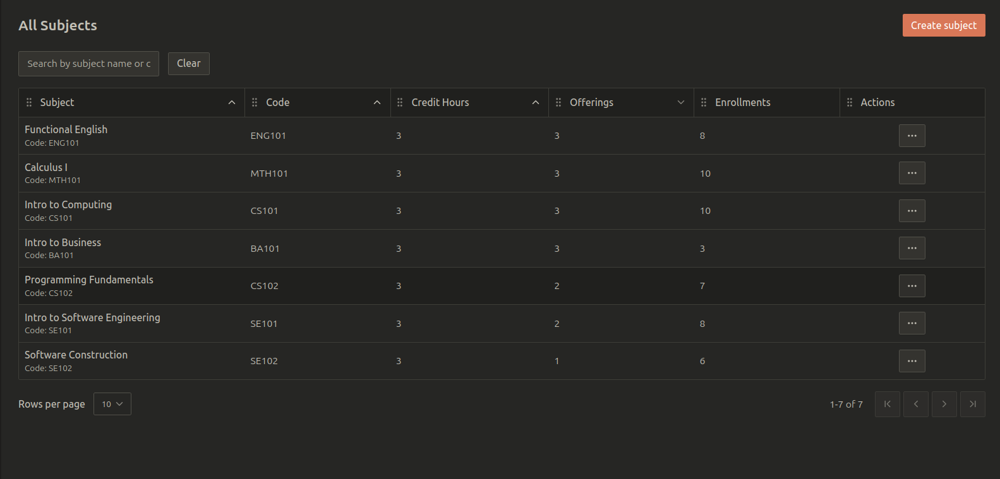

This covers how to use the Table Component in the project, including how to use it with data, handle actions, and customize its appearance.
This table is powered by Tanstack Table, Dnd kit and Shadcn UI.

## Features:

- Server-side data filtering:
    - URL based Sorting
    - Pagination
- Row actions
- Drag and drop column reordering

## Usage Example
import { Step, Steps } from 'fumadocs-ui/components/steps';

<Steps>

<Step>
### Create Search Params 

[Read more about search params](/docs/for-developers/dal#search-params-step).
</Step>

<Step>
### Get Data from Data File

[Read more about data access layer](/docs/for-developers/dal#get-data-from-server-using-prisma-and-nuqs-search-params-step).
</Step>

<Step>
### Create Table UI Component

create a table component that uses the data and search params to display the data in a table format. The table component should be able to handle sorting, pagination, and row actions.

```tsx lineNumbers title="app/(admin)/admin/subjects/_components/admin-subjects-table.tsx"
/* eslint-disable react-hooks/incompatible-library */
"use client";

export function AdminSubjectsTable({
  subjects,
  totalCount,
}: {
  subjects: AdminGetAllSubjectsType[];
  totalCount: number;
}) {
  "use no memo";
  const tableId = useId();
  const [isPending, startTransition] = useTransition();
  /// URL-synced sorting and pagination using nuqs.
  const [queryState, setQueryState] = useQueryStates(
    subjectsSearchParamsParsers,
    {
      history: "replace",
      shallow: false,
    }
  );

  const sorting: SortingState = queryState.sortBy
    ? [{ id: queryState.sortBy, desc: queryState.sortDir === "desc" }]
    : [];

  const hasActiveParams =
    queryState.page !== 1 ||
    queryState.pageSize !== APP.default_page_size ||
    queryState.sortBy !== "name" ||
    queryState.sortDir !== "asc" ||
    queryState.query.length > 0;

  const pagination: PaginationState = {
    pageIndex: Math.max(queryState.page - 1, 0),
    pageSize: queryState.pageSize,
  };

  const columns: ColumnDef<AdminGetAllSubjectsType>[] = [
    {
      id: "name",
      header: "Subject",
      accessorKey: "name",
      cell: ({ row }) => (
        <div className="flex flex-col">
          <Link
            href={`/admin/subjects/${row.original.id}`}
            className="font-medium underline-offset-4 hover:underline hover:text-primary group-hover:text-primary transition-colors "
          >
            {row.original.name}
          </Link>
          <span className="text-xs text-muted-foreground">
            Code: {row.original.code}
          </span>
        </div>
      ),
      sortUndefined: "last",
      sortDescFirst: false,
    },
    //...
    {
      id: "actions",
      header: "Actions",
      enableSorting: false,
      cell: ({ row }) => (
        <div className="text-center">
          <AdminsubjectOptionsDropdown subjectId={row.original.id} />
        </div>
      ),
    },
  ];

  const [columnOrder, setColumnOrder] = useState<string[]>(
    columns.map((column) => column.id as string)
  );

  const table = useReactTable({
    data: subjects,
    columns,
    columnResizeMode: "onChange",
    getCoreRowModel: getCoreRowModel(),
    onSortingChange: (updater) => {
      const nextSorting =
        typeof updater === "function" ? updater(sorting) : updater;
      const next = nextSorting[0];

      startTransition(() => {
        void setQueryState({
          sortBy: (next?.id ?? "name") as typeof queryState.sortBy,
          sortDir: next?.desc ? "desc" : "asc",
          page: 1,
        });
      });
    },
    onPaginationChange: (updater) => {
      const nextPagination =
        typeof updater === "function" ? updater(pagination) : updater;
      const nextPageIndex =
        nextPagination.pageSize === pagination.pageSize
          ? nextPagination.pageIndex
          : 0;

      startTransition(() => {
        void setQueryState({
          page: nextPageIndex + 1,
          pageSize: nextPagination.pageSize,
        });
      });
    },
    state: {
      sorting,
      columnOrder,
      pagination,
    },
    onColumnOrderChange: setColumnOrder,
    enableSortingRemoval: false,
    manualPagination: true,
    manualSorting: true,
    rowCount: totalCount,
  });

  function handleDragEnd(event: DragEndEvent) {
    const { active, over } = event;

    if (active && over && active.id !== over.id) {
      setColumnOrder((currentOrder) => {
        const oldIndex = currentOrder.indexOf(active.id as string);
        const newIndex = currentOrder.indexOf(over.id as string);

        return arrayMove(currentOrder, oldIndex, newIndex);
      });
    }
  }

  const sensors = useSensors(
    useSensor(MouseSensor, {}),
    useSensor(TouchSensor, {}),
    useSensor(KeyboardSensor, {})
  );

  /// URL-synced subject search filter.
  return (
    <div className="w-full" aria-busy={isPending}>
      <div className="mb-4 flex flex-wrap items-center gap-3">
        <div className="max-sm:w-full">
          <Label htmlFor="subject-search" className="sr-only">
            Search subjects
          </Label>
          <Input
            id="subject-search"
            placeholder="Search by subject name or code"
            value={queryState.query}
            onChange={(event) => {
              const nextValue = event.target.value;

              startTransition(() => {
                void setQueryState({
                  query: nextValue.trim().length > 0 ? nextValue : null,
                  page: 1,
                });
              });
            }}
          />
        </div>
        {hasActiveParams ? (
          <Button
            type="button"
            variant="outline"
            onClick={() => {
              startTransition(() => {
                void setQueryState(null);
              });
            }}
          >
            Clear
          </Button>
        ) : null}
      </div>
      <div className="rounded-md border">
        <DndContext
          id={tableId}
          collisionDetection={closestCenter}
          modifiers={[restrictToHorizontalAxis]}
          onDragEnd={handleDragEnd}
          sensors={sensors}
        >
          <Table>
            <TableHeader>
              {table.getHeaderGroups().map((headerGroup) => (
                <TableRow
                  key={headerGroup.id}
                  className="bg-muted/50 [&>th]:border-t-0"
                >
                  <SortableContext
                    items={columnOrder}
                    strategy={horizontalListSortingStrategy}
                  >
                    {headerGroup.headers.map((header) => (
                      <DraggableTableHeader<AdminGetAllSubjectsType>
                        key={header.id}
                        header={header}
                      />
                    ))}
                  </SortableContext>
                </TableRow>
              ))}
            </TableHeader>
            <TableBody>
              {table.getRowModel().rows?.length ? (
                table.getRowModel().rows.map((row) => (
                  <TableRow
                    key={row.id}
                    data-state={row.getIsSelected() && "selected"}
                  >
                    {row.getVisibleCells().map((cell) => (
                      <SortableContext
                        key={cell.id}
                        items={columnOrder}
                        strategy={horizontalListSortingStrategy}
                      >
                        <DragAlongCell<AdminGetAllSubjectsType> cell={cell} />
                      </SortableContext>
                    ))}
                  </TableRow>
                ))
              ) : (
                <TableRow>
                  <TableCell
                    colSpan={columns.length}
                    className="h-24 text-center"
                  >
                    No subjects found.
                  </TableCell>
                </TableRow>
              )}
            </TableBody>
          </Table>
        </DndContext>
      </div>

      <div className="flex flex-wrap items-center justify-between gap-4 py-4">
        <div className="flex items-center gap-3">
          <Label htmlFor={tableId} className="max-sm:sr-only">
            Rows per page
          </Label>
          <Select
            value={table.getState().pagination.pageSize.toString()}
            onValueChange={(value) => {
              table.setPageSize(Number(value));
            }}
          >
            <SelectTrigger id={tableId} className="w-fit whitespace-nowrap">
              <SelectValue placeholder="Select number of results" />
            </SelectTrigger>
            <SelectContent className="[&_*[role=option]]:pr-8 [&_*[role=option]]:pl-2 [&_*[role=option]>span]:right-2 [&_*[role=option]>span]:left-auto">
              {APP.page_sizes.map((pageSize) => (
                <SelectItem key={pageSize} value={pageSize.toString()}>
                  {pageSize}
                </SelectItem>
              ))}
            </SelectContent>
          </Select>
        </div>

        <div className="text-muted-foreground flex grow justify-end text-sm whitespace-nowrap">
          <p
            className="text-muted-foreground text-sm whitespace-nowrap"
            aria-live="polite"
          >
            <span className="text-foreground">
              {table.getState().pagination.pageIndex *
                table.getState().pagination.pageSize +
                1}
              -
              {Math.min(
                Math.max(
                  table.getState().pagination.pageIndex *
                    table.getState().pagination.pageSize +
                    table.getState().pagination.pageSize,
                  0
                ),
                table.getRowCount()
              )}
            </span>{" "}
            of{" "}
            <span className="text-foreground">
              {table.getRowCount().toString()}
            </span>
          </p>
        </div>

        <div>
          <Pagination>
            <PaginationContent>
              <PaginationItem>
                <Button
                  size="icon"
                  variant="outline"
                  className="disabled:pointer-events-none disabled:opacity-50"
                  onClick={() => table.firstPage()}
                  disabled={!table.getCanPreviousPage()}
                  aria-label="Go to first page"
                >
                  <ChevronFirst aria-hidden="true" />
                </Button>
              </PaginationItem>

              <PaginationItem>
                <Button
                  size="icon"
                  variant="outline"
                  className="disabled:pointer-events-none disabled:opacity-50"
                  onClick={() => table.previousPage()}
                  disabled={!table.getCanPreviousPage()}
                  aria-label="Go to previous page"
                >
                  <ChevronLeft aria-hidden="true" />
                </Button>
              </PaginationItem>

              <PaginationItem>
                <Button
                  size="icon"
                  variant="outline"
                  className="disabled:pointer-events-none disabled:opacity-50"
                  onClick={() => table.nextPage()}
                  disabled={!table.getCanNextPage()}
                  aria-label="Go to next page"
                >
                  <ChevronRight aria-hidden="true" />
                </Button>
              </PaginationItem>

              <PaginationItem>
                <Button
                  size="icon"
                  variant="outline"
                  className="disabled:pointer-events-none disabled:opacity-50"
                  onClick={() => table.lastPage()}
                  disabled={!table.getCanNextPage()}
                  aria-label="Go to last page"
                >
                  <ChevronLast aria-hidden="true" />
                </Button>
              </PaginationItem>
            </PaginationContent>
          </Pagination>
        </div>
      </div>
    </div>
  );
}
```

[See full example](https://github.com/Ali1raz/portal-cui/blob/f4d1774d3561f3f32e16a9c0e2dd3f4641705705/app/(admin)/admin/subjects/_components/admin-subjects-table.tsx)
</Step>

</Steps>

### Preview

<div className='dark:hidden block'>
  
</div>

<div className='hidden dark:block'>
  
  </div>